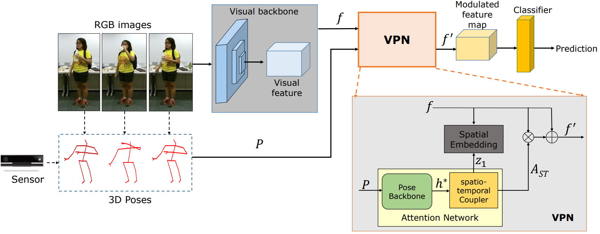

# VPN: Learning Video-Pose Embedding for Activities of Daily Living (ECCV 2020)

## Contributors 

[](https://sourcerer.io/fame/srv902/srijandas07/VPN/links/0)[](https://sourcerer.io/fame/srv902/srijandas07/VPN/links/1)[](https://sourcerer.io/fame/srv902/srijandas07/VPN/links/2)[](https://sourcerer.io/fame/srv902/srijandas07/VPN/links/3)[](https://sourcerer.io/fame/srv902/srijandas07/VPN/links/4)[](https://sourcerer.io/fame/srv902/srijandas07/VPN/links/5)[](https://sourcerer.io/fame/srv902/srijandas07/VPN/links/6)[](https://sourcerer.io/fame/srv902/srijandas07/VPN/links/7)

## News
Codes have been restructured and up for benchmarking on datasets.

## Introduction

This repository contains implementation of the paper Video-Pose Embedding For Activities of Daily Living (VPN) in Keras. VPN works with a base 3D video understanding model such as Inception3D for feature extraction and adds Pose based Attention Network to weight the importance of video features towards activity recognition. 

### VPN Architectural Overview


## Results
We show the results of VPN on four activity recognition datasets of varied complexity - Smarthomes, NTU-60, NTU-120 and NUCLA. 
* Results to be added from Paper.

## Get Started
Before the start of VPN training, following steps should be completed

* Create a new or use the existing configuration files stored in 'config' folder. The configuration files are specified by the model and the dataset type. Refer to args defined in the main.py file for more details.

* Specify the paths of following files needed as input for VPN in the config yaml file.
    * Skeleton : 3D pose data stored as npz files for each video clip
    * CNN      : RGB video data of 
    * Splits   : Training, Validation and Test video data splits

* Make sure the necessary folders for storing model weights are created.

* Currently, only NTU60 and NTU120 is working with this repo. Other datasets Smarthomes, NUCLA will be added in few weeks time. 


### Pre-Trained Models

|    Model   |    Dataset    |                           Weights                           |
|------------|---------------|-------------------------------------------------------------|
|     VPN    |  Smarthomes   | [Google Drive](https://drive.google.com/drive/u/0/my-drive) |
|     VPN    |  NTU-60       | [Google Drive](https://drive.google.com/drive/u/0/my-drive) |
|     VPN    |  NTU-120      | [Google Drive](https://drive.google.com/drive/u/0/my-drive) |
|     VPN    |  NUCLA        | [Google Drive](https://drive.google.com/drive/u/0/my-drive) |


## Train
To train VPN with I3D as backbone on NTU60, execute the below line. 

```
python main.py --dataset ntu60
```

## ToDos
- [x] Code restructuring to support future video datasets and 3D models
- [ ] Add support for Smarthomes and NUCLA datasets 
- [ ] Benchmarking results from Paper

## Citing VPN
    @misc{das2020vpn,
        title={VPN: Learning Video-Pose Embedding for Activities of Daily Living},
        author={Srijan Das and Saurav Sharma and Rui Dai and Francois Bremond and Monique Thonnat},
        year={2020},
        eprint={2007.03056},
        archivePrefix={arXiv},
        primaryClass={cs.CV}
    }
